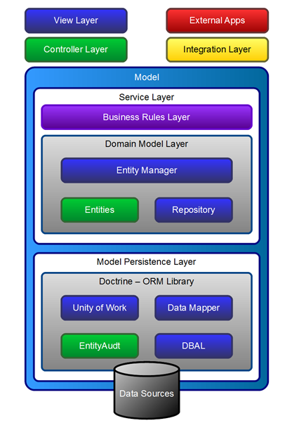

# SANSIS - BizlayBUNDLE

## Conceito

O BizlayBundle trabalha com o conceito principal de encapsulamento das regras de negócio e modelo de domínio
em uma camada por separada de todas as outras, reduzindo drásticamente a dependência do framework utilizado e
facilitando o reaproveitamento do código entre aplicações distintas.

O modelo do domínio é criado e manipulado através da biblioteca Doctrine, única dependência existente fora do
escopo do Symfony. Ou seja, em uma eventual utilização em outro framework, bastaria ter a doctrine disponível
e injetada na service para que o código funcionasse.

Seu nome vem do jargão Business Layer (Bizlay) - Camada de Negócio.

## Configuração

O BizlayBundle não possui praticamente nenhuma dependência além do jms/di-extra-bundle.

Adicione ao seu composer.json as seguintes linhas:

    "require": {
        ...
        "jms/di-extra-bundle": "dev-master",
        "sansis/Bizlay-bundle": "dev-master",
        ...
    }

E também os seguintes repositórios:

    "repositories": [
        ...
        {
            "type": "vcs",
            "url": "https://sansis.visualstudio.com/DefaultCollection/_git/BizlayBundle"
        },
        ...
    ]

## Design Patterns implantados

### Service Layer - Camada de Negócio

A Service layer é uma camada específica para o provimento das regras de negócio como serviços reutilizáveis.
Ela encapsula o modelo do domínio, e sua única dependência está na biblioteca doctrine. A inserção no Symfony
foi realizada com apoio da jms/di-extra-bundle que permite a criação da service e a injeção de dependência de
forma automática através de annotations. Nesse caso foi criado uma service para a servicedto, e injetados
tanto a servicedto quanto a doctrine.entitymanager.

O uso da Bizlay implica principalmente em aplicar o paradigma MVC tal qual ele deveria ter sido implantado desde o
início em PHP: a Controller não deve fazer nada além de controlar o fluxo da aplicação (rotas, redirecionamento, etc)
e fazer a ponte de comunicação entre as camadas View e Model. Neste caso filtros de acesso e de transformação da
informação de entrada e saída são realizados exclusivamente pela Controller.

A implantação de uma Service/Business Layer implica no isolamento da mesma da entrada e saída de dados, ou seja,
ela deve ser sempre implantada sem a criação ou manipulação de HTML. Dessa forma, as regras de negócio realmente
ficam encapsuladas e podem ser reaproveitadas tanto em controllers que gerem e utilizem views em HTML, quanto
em controllers que disponibilizem uma API Rest ou SOAP.

Maiores detalhes podem ser vistos em: http://martinfowler.com/eaaCatalog/serviceLayer.html

### DTO e VO - Data Transfer Object e Value Object

O encapsulamento da Service é obtido através do uso de um DTO - Objeto para transferência de dados, que replica
apenas a parte que pode ser manipulada na Service do objeto Request do Symfony, ou seja:

    - Query ($_GET)
    - Request ($_POST)
    - Session ($_SESSION)
    - Files ($_FILES)

Isto é feito através de um objeto base chamado ServiceDTO, que é estendido de acordo com o framework em uso,
permitindo a utilização da Service pela camada Controller. No caso do Symfony, o objeto injetado é o
SymfonyServiceDto, estando pendente sua implantação para outros frameworks. Ou seja, caso em algum momento
seja necessário integrar a Service com outro framework deve-se implantar.

Os elementos que compõem a ServiceDTO são apenas Bags, ou seja, VOs (Objetos de Valores) que transportam apenas
arrays de dados em seu interior, oferecendo uma API comum para obtenção e definição (get e set). Em contrapartida,
a Service também não deve retornar nenhum outro tipo de objeto, apenas estruturas em array.

O array é a estrutura complexa mais básica do PHP, flexível o suficiente para permitir um baixíssimo acoplamento
entre as camadas.

Maiores detalhes podem ser vistos em: http://martinfowler.com/eaaCatalog/dataTransferObject.html

## Utilização

Para utilizar a Bizlay, basta criar uma service estendendo da AbstractService disponibilizada. Esta classe
abstrata já define um construtor com a injeção dos parâmetros necessários para utilização com o Symfony.
A declaração de uma Service, ficaria então da seguinte forma:

        <?php
        namespace SanSIS\DevelBundle\Service;

        use \SanSIS\BizlayBundle\Service\AbstractService;
        use \JMS\DiExtraBundle\Annotation as DI;

        /**
         * @DI\Service("dbreverse.service")
         */
        class DbReverseService extends AbstractService
        {
        }

Agora, basta em qualquer controller chamar a service registrada da seguinte forma:

        ...
        $this->container->get('dbreverse.service');
        ...

### Resposta da  Service para a Controller

Nos casos os quais uma estrutura de uma entidade do modelo precise ser enviada para uma outra camada, estando essa
entidade estendendo da AbstractEntity provida na Bizlay, um método toArray estará disponível para a conversão
do objeto para o formato de array.

A maior problemática do envio de uma entidade para a Controller está na transformação do objeto em um formato que
vá para a entidade. Não é possível simplesmente executar um json_encode em uma entidade retornada do banco de dados,
por exemplo, pois há um conjunto de referências circulares (um objeto que referencia outro que o referencia de
volta, por exemplo), que impedem o uso desta forma. Por isso é importante estender as entidades da classe abstrata
provida e convertê-los para array antes de passá-los a outras camadas.

### Exemplos:

Maiores exemplos podem ser vistos nos Cruds gerados pela DevelBundle.

@author Pablo Santiago Sánchez - phackwer@gmail.com
